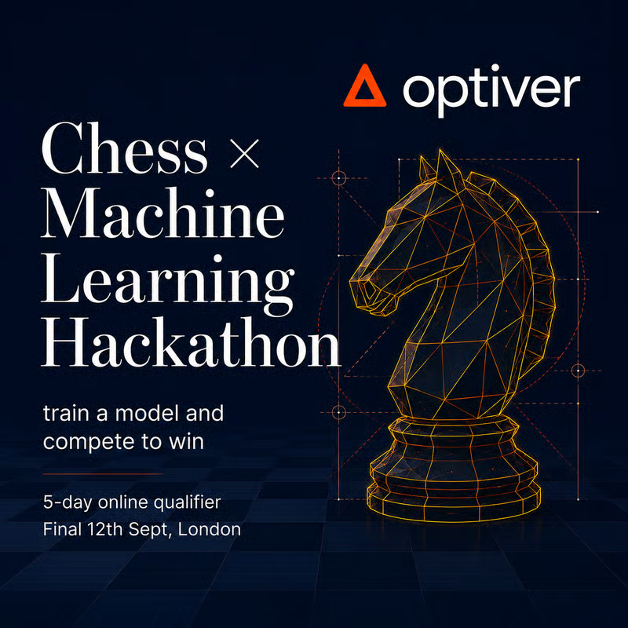
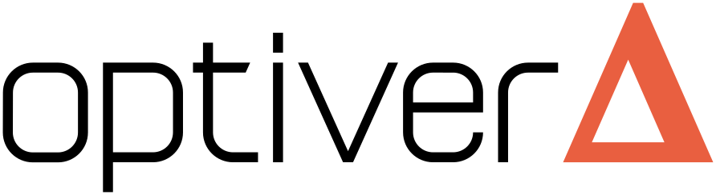

  

<h1 align="center">A chess engine built from scratch in Python</h1>

  <b>AI Chessathon 2026</b>, the worldwide Chess x Machine Learning hackathon sponsored by <a href="https://optiver.com">Optiver</a> 
  <b>Top 16 of 500+ teams</b> &nbsp;|&nbsp; solo entry &nbsp;|&nbsp; finalist at Encode Club, London, 12 September 2026

  
  
  
  

---

## The result

**500+ teams entered worldwide. 50 seats in the London final. One of them was mine.**

One person, no team. The competition asked for a single Python function,
`get_move(fen, time_left_ms)`, running on one CPU core with 2 GB of memory and 120
seconds on the clock, with no network, no third-party engines and no compiled binaries
allowed. Everyone played a week-long rated ladder, then a 13-round Swiss over frozen
builds decided who travelled to London.

This engine came through the qualifiers, finished **top 16 of 500+ teams**, the top 3%, and scores
**64% against Stockfish capped at 2800**, which puts it around 2850 on Stockfish's own
scale. It went from club level to that on a laptop and free cloud compute.

## How it was built

Every chess engine is two things: a **search** that explores moves, and an
**evaluation** that scores the positions it reaches. Almost all of the strength here
came from the evaluation.

### A neural network trained on a billion positions

The evaluation is an NNUE-style network, trained from scratch on Lichess games. The
pipeline scanned over a billion positions from nine months of the public database and
kept the 360 million that carried a Stockfish evaluation, streaming them one month at a
time through free Kaggle GPUs because no single machine could hold them.

What the network sees is every piece on every square, but relative to where each king
is standing, which is 12,288 separate inputs. Those feed a 1024-wide layer whose two
halves are then **multiplied together in pairs** rather than simply added. That is the
part that matters: multiplication lets the network say "this knight is dangerous
*because* that king is exposed", a judgement that no amount of adding independent
bonuses can express. Adding pairwise multiplication was worth 100 Elo on its own, the
single biggest jump of the project.

Twenty-seven networks were trained across six generations. Each one started from the
previous best and had to beat it over 192 games at two different time controls before it
was allowed anywhere near the submission. Most of them failed that test and were thrown
away.

### A search compiled down to machine code

Python is far too slow to search a chess tree, so the entire engine is compiled to
native machine code at start-up with numba, staying inside the competition's
"readable source only" rule while running at C speed. On top of that sit every
serious pruning technique in the field: principal variation search, null-move pruning
with an adaptive reduction, late-move reductions and pruning, internal iterative
reductions, static-exchange pruning, killers, history and continuation history.
Together they cut the search tree roughly **six-fold**, which is worth several extra
plies of depth on the same hardware. Move generation is bitboard-based and verified
both by perft and move-for-move against a reference implementation.

### Surviving a rule change on the morning of the final

Three hours before submissions closed, the organisers cut the start-up budget from 90
seconds to 30. My engine took 60 seconds to compile on their machine, which meant
forfeiting every single game.

Profiling found the cause: numba was compiling the entire search **three separate
times** because of the way constants were being passed into compiled functions. Fixing
that, splitting the compile into four stages that fit inside the budget, and moving
what was left into a background thread brought start-up from 60 seconds down to 17.
Two opponents in the practice rounds forfeited on initialisation that morning. Mine never
did.

## Nothing shipped without proof

Over ten thousand automated test games were played during the two weeks, on free cloud
compute, and no change was ever shipped without beating the version before it. In the
final week, thirteen promising search and time-management ideas were tested that way.
**All thirteen lost.** Being willing to measure them honestly and delete them is the
reason the engine that travelled to London was the strongest one built.

## Numbers

| | |
|---|---|
| Strength | ~2850 on Stockfish's UCI_Elo scale, 100 games at real time controls |
| Speed | ~670k nodes/s on an M4 laptop, ~300k on the competition core |
| Depth | 14 to 17 plies at 3 to 4 seconds per move |
| Network | 12,288 x 1024 (pairwise) x 32 x 1, 24 MB |
| Training data | 360M labelled positions from 9 months of Lichess games |
| Start-up | 17 s of the 30 s budget, down from 60 s |
| Verification | a nodes-to-depth bench, then 192 games at two time controls, per change |

## Acknowledgements

The AI Chessathon was organised and sponsored by **Optiver**, with the final hosted at
Encode Club, London. Training data comes from the
[Lichess open database](https://database.lichess.org). Built with
[python-chess](https://python-chess.readthedocs.io), [numba](https://numba.pydata.org)
and [PyTorch](https://pytorch.org). The opening book is the freely distributed Polyglot
book gm2001.bin.
